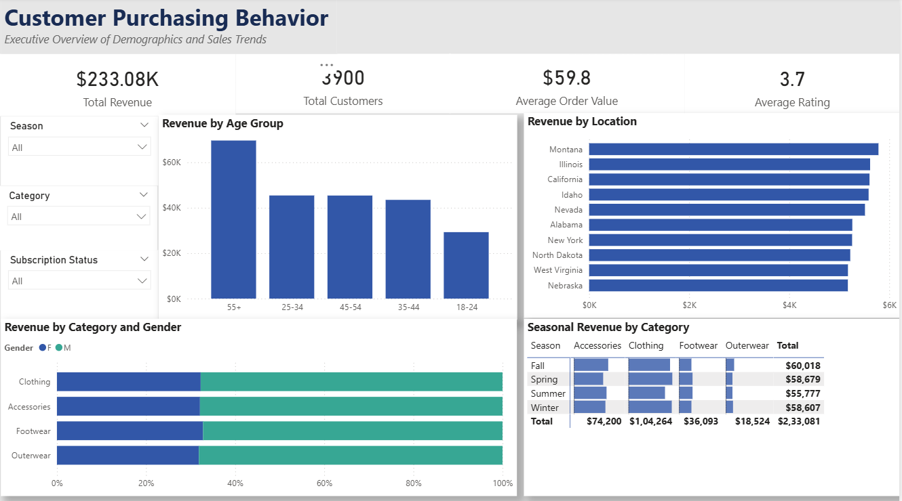

# 🛒 Customer Purchasing Behavior Analysis

## 📌 Project Overview
This project analyzes a dataset of 3,900 retail transactions to uncover actionable insights into customer demographics, seasonal purchasing trends, and product category performance. Designed with an emphasis on UI/UX best practices, this executive dashboard provides data-driven recommendations for targeted marketing, inventory optimization, and sales strategy.

## 📊 Dashboard Preview

## ⚙️ Interactive Features
This dashboard is a single-page application built for high-level executive review and is fully optimized for both **Desktop and Mobile viewing**. 
- **Dynamic Slicers:** Users can filter the entire report by `Season`, `Category`, and `Subscription Status`.
- **Cross-Filtering:** Clicking on any visual element (e.g., a specific age group or location) instantly cross-filters the rest of the page to reveal granular micro-trends.

## 💡 Key Business Visuals & Insights
- **Executive KPIs:** High-visibility tracking of `Total Revenue`, `Total Customers`, `Average Order Value (AOV)`, and `Average Rating`.
- **Demographic Targeting (Column Chart):** Revenue breakdown by custom `Age Group` bins to identify the most profitable generations.
- **Category Split by Gender (100% Stacked Bar):** Proportional analysis of how different product categories (Clothing, Footwear, Outerwear, Accessories) lean toward male or female consumers.
- **Regional Performance (Horizontal Bar Chart):** Dynamically filtered to highlight the Top 10 Locations/States driving the highest sales volume.
- **Seasonal Revenue Heatmap (Matrix):** Utilizes inline conditional Data Bars to instantly identify which product categories peak during specific seasons.

## 🛠️ Technical Skills Demonstrated
- **Advanced DAX:** Built explicit measures for all core KPIs using `SUM`, `AVERAGE`, `DISTINCTCOUNT`, and `DIVIDE` to ensure calculation integrity over default aggregations.
- **Data Modeling best practices:** Cleaned the semantic model by hiding raw, unused, and background columns from the report view to create a foolproof, production-ready user interface.
- **Custom Binning:** Implemented custom conditional logic (`SWITCH` functions) to group raw age data into clean `Age Group` buckets for streamlined demographic visualization.
- **UI/UX Design:** Applied professional design principles including a strict grid layout, monochromatic aesthetic, custom visual shadows, removed redundant axes, and mobile-layout optimization.

## 📂 Repository Contents
* `Customer_Shopping_Behavior.pbix` - The completed, interactive Power BI file.
* `shopping_behavior.csv` - The clean dataset used to build the model.
* `dashboard_preview.png` - High-resolution screenshot of the dashboard.
